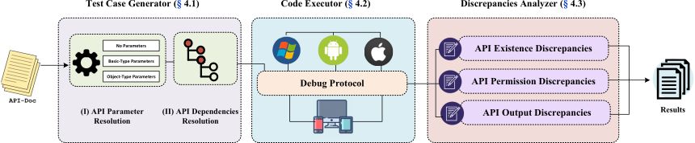

# APIDiff

APIDiff is an automatic tool that generates test cases for each API and identifies execution discrepancies.

<p align="center"></p>

We implemented APIDiff based on Node.JS and typescript.
For more implementation details, please refer to our [paper](https://chaowang.dev/publications/sec23a.pdf).

## Table of contents

- [APIDiff](#apidiff)
  - [Table of contents](#table-of-contents)
  - [Prerequisites](#prerequisites)
    - [Environment](#environment)
    - [Dependencies](#dependencies)
    - [Pre-processing](#pre-processing)
  - [Quick start](#quick-start)
  - [Citation](#citation)
  - [License](#license)


## Prerequisites

### Environment

You need the following software requirements to run the tools:

* **OS**
    - Linux
    - macOS
    - Windows
* **Node.JS**
* **WeChat DevTools**

You will also need the following hardwares to conduct experiments:

* **Devices**
    - Android
    - iOS
    - Windows

You will also need a WeChat account to create and debug a MiniApp for API testing.

### Dependencies

Install dependencies for three modules

```bash
# make sure node.js and npm is installed
node --version

# install for apitest-gen
cd apitest-gen && yarn && cd ..

# install for client
cd client && yarn && cd ..

# install for server
cd server && yarn && cd ..
```

### Pre-processing

You will need the API document for `apitest-gen`.
Please note that we are not able to provide such web crawlers due to potential legal implications.
We offer the `typescript` object description for structured API document, please refer to
[apitest-gen/src/model/API.ts](apitest-gen/src/model/API.ts) for more information.


## Quick start

### Generate the test cases

Make sure you have documents available for the test case generation. Note that the input document should be an array of `API` (Array<API> in typescript) in JSON format. You can refer to [Pre-processing](#pre-processing) for more information.

You can specify the input document file via [apitest-gen/src/apigen/config.ts](apitest-gen/src/apigen/config.ts) or via the environment variable `INPUT_DOC`.

You can specify the output directory via the same config file or via the environment variable `OUTPUT_DIR`.

Then, execute the [apitest-gen/src/apigen/main.ts](apitest-gen/src/apigen/main.ts) to generate test cases.

```bash
ts-node apitest-gen/src/apigen/main.ts
```

### Find the debug URL

The debug URL is embedded in WeChat DevTools. You need a WeChat account to create and test a MiniApp, and via initiating a remote debug session you can obtain such a debug URL.

1. Tweak the WeChat DevTools

Locate your WeChat DevTools installation directory, look for `package.json` inside `package.nw` (in macOS the location is `/Applications/wechatwebdevtools.app/Contents/Resources/package.nw/package.json`).
Then, find the `--disable-devtools` flag, remove it and save the file.

2. Initiate a remote debug session

Choose a device target to start a remote debug session. Make sure you are using `remote-debug` 2.0 and enable LAN mode for best network latency. Make sure the remote debugger window is popped.

3. Find the debug URL

Make sure the current focused window is the remote debugger, press F12 to open the chrome devtools. Switch to the `Elements` tab and find the `webview` tag (the selector is `body > div:nth-child(1) > div > div > div.debugger > webview`). Now you can find the debug string is inside the `src` property starting with `ws=`. An example debug string is `ws=127.0.0.1:40204`. You can now transform this string into the debug URL: `ws://127.0.0.1:40204`.

### Run the server

Make sure you have all dependencies installed.
Then, you can start a server directly by the following command

```bash
cd server
REMOTE_DEBUG_WS=<your debug URL> ts-node agent/index.ts
```

Make sure the `[evaluator init] globalThis is writable` message is prompted after running the server.
If you did not see this message, the debug URL might be invalid due to timeout. You need to redo the previous steps. Note that the debug URL won’t change as long as the WeChat DevTools is not closed or restarted.

You can also interact with the debugger via specifying `ENABLE_NODE_REPL` environment variable. The Node.JS REPL contains global objects for debugging. Please refer to [server/agent/index.ts](server/agent/index.ts) for more information.

The server will open a port for the incoming requests from the client. You can specify the port in [server/agent/listener/config.ts](server/agent/listener/config.ts)

### Run the client

You can now run the client to start testing. You need to change the config file defined in [client/src/config.ts](client/src/config.ts) based on your previous configuration.
After that, you can run the client by the following command

```bash
cd client && ts-node src/index.ts
```


# Citation
If you find APIDiff useful, please consider citing our paper:

```bibtex
@inproceedings{wang2023one,
  title={One Size Does Not Fit All: Uncovering and Exploiting Cross Platform Discrepant APIs in WeChat.},
  author={Wang, Chao and Zhang, Yue and Lin, Zhiqiang},
  booktitle={32nd USENIX Security Symposium (USENIX Security 23)},
  year={2023}
}
```


# License

This project is licensed under the terms of the Apache 2.0 license.

